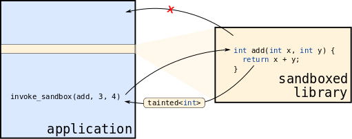

.. sectnum::

.. contents::

.. toctree::
   :maxdepth: 2
   :caption: Contents:

Overview
========

This is a short tutorial on the RLBox API. If you are looking for a reference
of all APIs, see [Doxygen]_.

RLBox is a toolkit for sandboxing third-party libraries. The toolkit consists
of (1) a Wasm-based sandbox and (2) an API for retrofitting existing
application code to interface with a sandboxed library.  The Wasm-based sandbox
is documented in its `corresponding repository
<https://github.com/PLSysSec/rlbox_wasm2c_sandbox>`_. While, the RLBox API can
be used with different sandbox implementations (discussed :ref:`later
<stdlib>`), this documentation focuses on the API and the interface you will use
when sandboxing code, independent of the underlying sandboxing mechanism.

**Why do we need a sandboxing API?**
Sandboxing libraries without the RLBox API is both tedious and error-prone.
This is especially the case when retrofitting an existing codebase like Firefox
where libraries are trusted and thus the application-library boundary is
blurry.  To sandbox a library -- and thus to move to a world where the library
is no longer trusted -- we need to modify this application-library boundary. 
For example, we need to add security checks in Firefox to ensure that any value
from the sandboxed library is properly validated before it is used.  Otherwise,
the library (when compromised) may be able to abuse Firefox code to hijack its
control flow (see [RLBoxPaper]_ for details). The RLBox API is explicitly
designed to make retrofitting of existing application code simpler and less
error-prone.

**Sandboxing architecture overview** As shown in :numref:`arch-fig`, RLBox ensures that a
sandboxed library is *memory isolated* from the rest of the application -- the
library cannot directly access memory outside its designated region -- and that
all *boundary crossings are explicit*. This ensures that the library cannot,
for example, corrupt Firefox's address space. It also ensures that Firefox
cannot inadvertently expose sensitive data to the library (e.g., pointers that
would leak its ASLR).

.. _arch-fig:

   Sandboxed libraries are isolated from the application and all communication
   between the sandboxed library and application code is mediated. This ensures
   that the application code is robust and does not use untrusted,
   :ref:`tainted values <tainted>` without checking them.

Memory isolation is enforced by the underlying sandboxing mechanism (from the
start, when you create the sandbox with :ref:`create_sandbox() <create_sandbox>`). Explicit
boundary crossings are enforced by RLBox (either at compile- or and run-time).
For example, with RLBox you can't call library functions directly; instead, you
must use the :ref:`invoke_sandbox_function() <invoke_sandbox_function>` method. Similarly, the library cannot
call arbitrary Firefox functions; instead, it can only call functions that you
expose with the :ref:`register_callback() <register_callback>` method. (To
simplify the sandboxing task, though, RLBox does expose a standard library as
described in :ref:`stdlib`.)

When calling a library function, RLBox copies simple values into the sandbox
memory before calling the function. For larger data types, such as structs and
arrays, you can't simply pass a pointer to the object. This would leak ASLR
and, more importantly, would not work: sandboxed code cannot access application
memory.  So, you must explicitly allocate memory in the sandbox via
:ref:`malloc_in_sandbox() <malloc_in_sandbox>` and copy application data to
this region of memory (e.g., via ``strncpy``).

RLBox similarly copies simple return values and callback arguments. Larger data
structures, however, must (again) be passed by *sandbox-reference*, i.e., via a
reference/pointer to sandbox memory.

To ensure that application code doesn't use values that originate in the
sandbox -- and may thus be under the control of an attacker -- unsafely, RLBox
considers all such values as untrusted and :ref:`taints <tainted>` them.
Tainted values are essentially opaque values (though RLBox does provide some
:ref:`basic operators on tainted values <tainted_ops>`). To use a tainted
value, you must unwrap it by copying the value into application memory -- and
thus out of the reach of the attacker -- and *verifying* it. Indeed, RLBox
forces application code to perform the copy and verification in sync using
:ref:`verifiction functions <verification>`.

Example library sandboxing
--------------------------

To get a feel for what it's like to use RLBox, we're going to sandbox a tiny
library ``mylib`` that has four functions::

   // mylib.c:

   void hello() {
      printf("Hello world from mylib\n");
   }

   unsigned add(unsigned a, unsigned b) {
      return a + b;
   }

   void echo(const char* str) {
      printf("> mylib: %s\n", str);
   }

   void call_cb(void (*cb) (const char* str)) {
      cb("hi again!");
   }

   int get_error_code() {
      return 0;
   }

This is not the most interesting library, security-wise, but it is complicated
enough to demonstrate various RLBox features.

To get started, in our main application file let's first import the RLBox
library::

   // main.cpp:

   #define RLBOX_SINGLE_THREADED_INVOCATIONS
   #define RLBOX_USE_STATIC_CALLS() rlbox_noop_sandbox_lookup_symbol

   #include <stdio.h>
   #include "mylib.h"
   #include "rlbox.hpp"
   #include "rlbox_noop_sandbox.hpp"

   using namespace rlbox;
   ...

In our main function, let's now create a new sandbox (for this example we're
going to use the NULL sandbox) and call the ``hello`` function::

   ...
   int main(int argc, char const *argv[]) {

      // Create a new sandbox
      rlbox::rlbox_sandbox<rlbox_noop_sandbox> sandbox;
      sandbox.create_sandbox();

      // call the library hello function
      sandbox.invoke_sandbox_function(hello);
   ...

Note that we do not call ``hello()`` directly. Instead, we use the
:ref:`invoke_sandbox_function() <invoke_sandbox_function>` method. We can similarly call the
``add`` function::

   ...
      // call the add function and check the result:
      auto ok = sandbox.invoke_sandbox_function(add, 3, 4).copy_and_verify({
            printf("Adding... 3+4 = %d\n", ret);
            return ret == 7;
      });
      printf("OK? = %d\n", ok);
   ...

This invocation is a bit more interesting. First, we call ``add`` with
arguments. Second, RLBox ensures that the ``unsigned`` return value that
``add`` returns is :ref:`tainted <tainted>` and thus cannot be used without
verification. Here, we call the copy_and_verify
function which copies the value into application memory and runs our verifier
function::

      {
            printf("Adding... 3+4 = %d\n", ret);
            return ret == 7;
      }

This lambda simply prints the tainted value and returns ``true`` if it is
``7``. A compromised library could return any value and if we use this value
to, say, index an array this could potentially introduce an out-of-bounds
memory access.

Let's now call the ``echo`` function which takes a slightly more interesting
argument: a string. Here, we can't simply pass a string literal as an argument:
the sandbox cannot access application memory where this would be allocated.
Instead, we must allocate a buffer in sandbox memory and copy the string we
want to pass to ``echo`` into this region::

   ...
      const char* helloStr = "hi hi!";
      size_t helloSize = strlen(helloStr) + 1;
      // allocate memory in the sandbox:
      auto taintedStr = sandbox.malloc_in_sandbox<char>(helloSize);
      // copy helloStr into the sandbox:
      std::strncpy(taintedStr.unverified_safe_pointer_because(helloSize, "writing to region"), helloStr, helloSize);
   ...

Here ``taintedStr`` is actually a :ref:`tainted <tainted>` string: it
lives in the sandbox memory and could be written to by the (compromised)
library code concurrently. As such, it's unsafe for us to use this pointer
without verification. Above, we use the "unverified_safe_pointer_because"
verifier which basically removes the taint without
any verification. This is safe because we copy the ``helloStr`` to sandbox
memory: at worst, the sandboxed library can overwrite the memory region pointed
to by ``taintedStr`` and crash when it tries to print it.

Note that the string "writing to region" does not have any special meaning in
the code. Rather the RLBox API asks you to provide a free-form string that acts
as documentation. Essentially you are providing a string saying "it is safe to
remove the tainting from this type because ...". Such documentation may be
useful to other developers who read your code. As discussed, in the above
example, a write to the region cannot cause a memory safety error in the
application".

Now, we can just call the function and free the allocated string::

   ...
      sandbox.invoke_sandbox_function(echo, taintedStr);
      sandbox.free_in_sandbox(taintedStr);
   ...

Finally, let's call the ``call_cb`` function. To do this, let's first define a
callback for the function to call. We define this function above the ``main``
function::
   
   ...
   void hello_cb(rlbox_sandbox<rlbox_noop_sandbox>& _,
               tainted<const char*, rlbox_noop_sandbox> str) {
      auto checked_string =
         str.copy_and_verify_string( {
            return std::strlen(val.get()) < 1024 ? std::move(val) : nullptr;
         });
      printf("hello_cb: %s\n", checked_string.get());
   }
   ...

This callback is called with a string. We thus call the :ref:`string
verification function <copy_and_verify_string>` with a simple verifier::

   ...
       {
           return std::strlen(val.get()) < 1024 ? std::move(val) : nullptr;
       }
   ...

This verifier moves the string if it's length is less than 1KB and otherwise
returns the ``nullptr``. In the callback we simply print this (potentially
null) string.

Let's now continue in ``main``, register the callback -- otherwise RLBox will
disallow the library-application call -- and pass the callback to the
``call_cb`` function::

   ...
      // register callback and call it
      auto cb = sandbox.register_callback(hello_cb);
      sandbox.invoke_sandbox_function(call_cb, cb);

      // `cb` is unregistered automatically once it goes out of scope
      // Once unregistered, the callback cannot be invoked any further
      // We can also manually unregister it if we want to unregister it sooner
      cb.unregister();
   ...

Finally, let's destroy the sandbox and exit::

   ...
      // destroy sandbox
      sandbox.destroy_sandbox();

      return 0;
   }

Core API
========

In this section we describe a large part of the RLBox API you are likely to
encounter when porting libraries. The API has some more advanced features and
types that are necessary but not as commonly used (see [Doxygen]_).  In most
cases the RLBox type system will give you an informative error if and how to
use these features.

Creating (and destroying) sandboxes
-----------------------------------

RLBox encapsulates sandboxes with :ref:`rlbox_sandbox <rlbox_sandbox>` class.
For now, RLBox supports two sandboxes: a Wasm-based sandboxed and the *null*
sandbox. The null sandbox doesn't actually enforce any isolation, but is very
useful for migrating an existing codebase to use the RLBox API.  In fact, in
most cases you want to port the existing code to use RLBox when interfacing
with a particular library and only then switch over to the Wasm-based sandbox. 

.. _rlbox_sandbox:
.. doxygenclass:: rlbox::rlbox_sandbox

.. doxygenclass:: rlbox::rlbox_noop_sandbox

.. _create_sandbox:
.. doxygenfunction:: create_sandbox

Creating sandboxes is mostly straightforward.  For the null sandbox, however,
you need to add a ``#define`` at the top of your entry file, before you include
the RLBox headers::

  #define RLBOX_USE_STATIC_CALLS() rlbox_noop_sandbox_lookup_symbol
  ...
  rlbox::rlbox_sandbox<rlbox_noop_sandbox> sandbox;
  sandbox.create_sandbox();

.. _destroy_sandbox:
.. doxygenfunction:: destroy_sandbox

It's important to destroy a sandbox after you are done with it. This ensures
that the memory footprint of sandboxing remains low. Once you destroy a sandbox
though, it is an error to use the sandbox object.

Calling sandboxed library functions
-----------------------------------

RLBox disallows code from calling sandboxed library functions directly.
Instead, application code must use the :ref:`invoke_sandbox_function() <invoke_sandbox_function>`
method.

.. _invoke_sandbox_function:
.. doxygendefine:: invoke_sandbox_function

Though this function is defined via macros, RLBox uses some template and macro
magic to make this look like a :ref:`sandbox <rlbox_sandbox>` method. So, in
general, you can call sandboxed library functions as::

  // call foo(4)
  auto result = sandbox.invoke_sandbox_function(foo, 4);

Exposing functions to sandboxed code
------------------------------------

Application code can expose :ref:`callback functions <callback>` to sandbox via
:ref:`register_callback() <register_callback>`.  These functions can be called
by the sandboxed code until they are unregistered via the `unregister()` function.

.. _register_callback:

The type signatures of :ref:`register_callback() <register_callback>`
function is a bit daunting. In short, the function takes a :ref:`callback
function <callback>` and returns a function pointer that can be passed to the
sandbox (e.g., via :ref:`invoke_sandbox_function() <invoke_sandbox_function>`).

.. _callback:

A *callback function* is a function that has a special type:

* The first argument of the function must be a reference a :ref:`sandbox
  <rlbox_sandbox>` object.
* The remaining arguments must be :ref:`tainted <tainted>`.
* The return value must be :ref:`tainted <tainted>` or ``void``. This ensures
  that the application cannot accidentally leak data to the sandbox.

Forcing arguments to be :ref:`tainted <tainted>` forces the application to
handled values coming from the sandbox with care. Dually, the return type
ensures that the application cannot accidentally leak data to the sandbox.

Tainted values
--------------

Values that originate in the sandbox are *tainted*. We use a special tainted
type :ref:`tainted <tainted>` to encapsulate such values and prevent the
application from using tainted values unsafely.

.. _tainted:
.. doxygenclass:: rlbox::tainted

RLBox has several kinds of tainted values, beyond :ref:`tainted <tainted>`.
Thse, however, are slightly less pervasive in the surface API.

.. _tainted_volatile:
.. doxygenclass:: rlbox::tainted_volatile

.. _tainted_boolean_hint:
.. doxygenclass:: rlbox::tainted_boolean_hint

.. _verification:

Unwrapping tainted values
^^^^^^^^^^^^^^^^^^^^^^^^^

To use tainted values, the application can copy
the value to application memory, verify the value, and unwrap it. RLBox
provides several functions to do this.

.. doxygenfunction:: copy_and_verify

For a given tainted type, the verifier should have the following signature:

+------------------------+---------------+----------------------------------+
| Tainted type kind      |  Example type | Example verifier                 |
+========================+===============+==================================+
| Simple type            |  ``int``      | ``T_Ret(*)(int)``                |
+------------------------+---------------+----------------------------------+
| Pointer to simple type |  ``int*``     | ``T_Ret(*)(unique_ptr<int>)``    |
+------------------------+---------------+----------------------------------+
| Pointer to class type  |  ``Foo*``     | ``T_Ret(*)(unique_ptr<Foo>)``    |
+------------------------+---------------+----------------------------------+
| Pointer to array       |  ``int[4]``   | ``T_Ret(*)(std::array<int, 4>)`` |
+------------------------+---------------+----------------------------------+
| Class type             |  ``Foo``      | ``T_Ret(*)(tainted<Foo>)``       |
+------------------------+---------------+----------------------------------+

In general, the return type of the verifier ``T_Ret`` is not constrained and can
be anything the caller chooses.

.. doxygenfunction:: copy_and_verify_range
.. _copy_and_verify_string:
.. doxygenfunction:: copy_and_verify_string
.. doxygenfunction:: copy_and_verify_address

In some cases it's useful to unwrap tainted values without verification.
Sometimes this is safe to do and RLBox provides a method for doing so
called ``unverified_safe_because``

Since pointers are special (sandbox code may modify the data the pointer
points to), we have a similar function for pointers called
unverified_safe_pointer_because. This API requires specifying the number of
elements being pointed to for safety.

We however provide additional functions that are especially useful during
migration:

.. _UNSAFE_unverified:
.. doxygenclass:: rlbox::tainted_base_impl
   :members: UNSAFE_unverified, UNSAFE_sandboxed

These functions are also available for :ref:`callback <callback>`

.. danger::  Unchecked unwrapped tainted values can be abused by a compromised
   or malicious library to potentially compromise the application.

.. _tainted_ops:

Operating on tainted values
^^^^^^^^^^^^^^^^^^^^^^^^^^^
Unwrapping tainted values requires care -- getting a verifier wrong could lead
to a security vulnerability. It's also not cheap: we need to copy data to the
application memory to ensure that the sandboxed code cannot modify the data
we're tyring to verify. Lucikly, it's not always necessary to copy and verify:
sometimes we can compute on tainted values directly. To this end, RLBox defines
different kinds of operators on tainted values, which produce tainted values.
This allows you to perform some computations on tainted values, pass the values
back into the sandbox, and only later unwrap a tainted value when you need to.
operators like ``+`` and ``-`` on tainted values.

+-------------------------+------------------------------------------------+
|  Class of operator      |  Supported operators                           |
+=========================+================================================+
|  Arithmetic operators   |  ``=``, ``+``, ``-``, ``*``, ``/``, ``%``,     |
|                         |  ``++``, ``--``                                |
+-------------------------+------------------------------------------------+
|  Relational operators   |  ``==``, ``!=``, ``<``, ``<=``, ``>``, ``>=``  |
+-------------------------+------------------------------------------------+
|    Logical operators    |  ``!``, ``&&`` (limited), ``||`` (limited)     |
+-------------------------+------------------------------------------------+
|    Bitwise operators    |  ``~``, ``&``, ``|``, ``^``, ``<<``, ``>>``    |
+-------------------------+------------------------------------------------+
|    Compound operators   |  ``+=``, ``-=``, ``*=``, ``/=``, ``%=``,       |
|                         |  ``&=``, ``|=``, ``^=``, ``<<=``, ``>>=``      |
+-------------------------+------------------------------------------------+
|   Pointer operators     |  ``[]``, ``*``, ``&``, ``->``                  |
+-------------------------+------------------------------------------------+

When applying a binary operator like ``<<`` to a tainted value and an untainted
values the result is always tainted.

RLBox also defines several comparison operators on tainted values that sometime
unwrap the result:

* Operators ``==``, ``!=`` on tainted pointers is allowed if the rhs is
  ``nullptr_t`` and return unwrapped ``bool``.

* Operator ``!`` on tainted pointers retruns an unwrapped ``bool``.

* Operators ``==``, ``!=``, ``!`` on non-pointer tainted values return a
  ``tainted<bool>``

* Operators ``==``, ``!=``, ``!`` on :ref:`tainted_volatile <tainted_volatile>`
  values returns a :ref:`tainted_boolean_hint <tainted_boolean_hint>`

* Operators ``&&`` and ``||`` on booleans are only permitted when arguments are
  variables (not expressions). This is because C++ does not permit safe
  overloading of && and || operations with expression arguments as this affects
  the short circuiting behaviour of these operations.

Application-sandbox shared memory
---------------------------------

Since sandboxed code cannot access application memory, to share objects across
the boundary you need to explicitly allocate memory that both the application
and sandbox can access. To this end, :ref:`malloc_in_sandbox()
<malloc_in_sandbox>` allocates memory within the sandbox region and returns a
:ref:`tainted <tainted>` pointer that can be used by both the application and
sandbox (e.g., by passing the pointer as an argument to a function).

.. _malloc_in_sandbox:
.. doxygenfunction:: malloc_in_sandbox()
.. doxygenfunction:: malloc_in_sandbox(uint32_t)

.. _free_in_sandbox:

Migrating code by temporarily removing tainting
-----------------------------------------------

RLBox is designed to simplify working with existing applications/code bases.
Rather than migrating an application to use RLBox's APIs in a single shot, RLBox
allows "incremental migration" to simplify this step. In particular, migrating
existing code to use RLBox APIs i.e. using `tainted` types and replacing
function calls to libraries with :ref:`invoke_sandbox_function()
<invoke_sandbox_function>` method, can be performed one line at a time. After
each such migration, you can continue to build, run/test the program with full
functionality to make sure the migration step is correct.

For example consider migrating some existing code that uses ``mylib``::

   // app.c:

   void print_error_message() {
      char* msgs[] = { "Success", "Fail" };
      int result = get_error_code();
      printf("Result: %s\n", msgs[result]);
      ...
   }

Rather than migrating the full function to use RLBox, you can migrate just the
call to ``get_error_code`` by leveraging the :ref:`UNSAFE_unverified
<UNSAFE_unverified>` APIs to removing the tainting::

   // app.c:

   void print_error_message() {
      char* msgs[] = { "Success", "Fail" };

      // Migrate this line to use the RLBox API
      tainted<int, rlbox_noop_sandbox> tainted_result = get_error_code();
      int result = tainted_result.UNSAFE_unverified();

      // Not migrated
      printf("Result: %s\n", msgs[result]);
      ...
   }

Observe that by renaming variables, we can easily leave the other lines of code unmodified.
After building and testing this step, we can now migrate the line that prints the message::

   // app.c:

   void print_error_message() {
      char* msgs[] = { "Success", "Fail" };

      // Migrate this line to use the RLBox API
      auto tainted_result = get_error_code();

      // Not migrated
      printf("Result: %s\n", msgs[tainted_result.UNSAFE_unverified()]);

      int result = tainted_result.UNSAFE_unverified();
      ...
   }

Similarly, we can proceed with replacing all uses of result in the ``...`` portion of code as well.

As the "UNSAFE" portion of the ``UNSAFE_unverified`` API indicates, migration is
**NOT** complete until we replace the uses of ``UNSAFE_unverified`` with
``copy_and_verify`` or ``unverified_safe_because`` as discussed in
:ref:`verification`. Here, the since ``tainted_result`` is being used to access
an array of size 2, we can verify it as shown below::

   printf("Result: %s\n", msgs[tainted_result.copy_and_verify({
      if (val < 0 or val >= 2) { abort(); }
      return val;
   }));

The exact opposite of the ``UNSAFE_unverified`` function i.e. converting
regularly "untainted" data to ``tainted`` is also available:

+------------------------+---------------+----------------------------------------+----------------------------------------------+
| Tainted type kind      |  Example type | Converted type                         | Conversion API                               |
+========================+===============+========================================+==============================================+
| Simple type            |  ``int``      | ``tainted<int, rlbox_noop_sandbox>``   | Automatic conversion. No code change needed. |
+------------------------+---------------+----------------------------------------+----------------------------------------------+
| Pointer to type        |  ``Foo*``     | ``tainted<Foo*, rlbox_noop_sandbox>``  | ``sandbox.UNSAFE_accept_pointer(ptr)``       |
+------------------------+---------------+----------------------------------------+----------------------------------------------+

.. _stdlib:

Standard library
----------------

RLBox provides several helper functions to application for handling tainted data
(memory influenced by or located in sandoxed regions) similar to the C/C++
standard library. We list a few of these below; they operate similar to the
standard library equivalents, but they accept tainted data.

.. doxygenfunction:: memset

|

.. doxygenfunction:: memcpy

|

.. doxygenfunction:: sandbox_reinterpret_cast

|

.. doxygenfunction:: sandbox_const_cast

|

.. doxygenfunction:: sandbox_static_cast

Handling more complex ABIs
==========================

Passing structs to/from a sandbox 
---------------------------------

Passing a struct from the sandbox to the application code requires the tainted
struct be unwrapped. To do this, a file is needed to provide rlbox with the 
memory layout of the struct. Below we describe the steps to allow the unwrapping
of a tainted struct.

To use the struct definition file from the application code, the following two 
lines should be added::

   // main.cpp:
   
   #include "lib_struct_file.h"
   rlbox_load_structs_from_library(mylib); 

The first line includes the struct file which is named lib_struct_file.h in this 
example. The second line loads the struct definitions via the alias “mylib” 
defined inside the struct file. 

Assume the user is trying to untaint the member variable width within Foo given 
the below struct definitions::

   // mylib.h:

   struct Inner {
      int val;
   }
   
   struct Foo {
      unsigned char[5] status_array;
      Inner internal;
      unsigned int width;
   }

The struct definition for Foo alone would be as follows::

   ...
   #define sandbox_fields_reflection_mylib_class_Foo(f, g, ...)         \
     f(unsigned char[5], status_array, FIELD_NORMAL, ##__VA_ARGS__) g() \
     f(Inner, internal, FIELD_NORMAL, ##__VA_ARGS__) g()                \
     f(unsigned int, width, FIELD_NORMAL, ##__VA_ARGS__) g()
     
   #define sandbox_fields_reflection_mylib_allClasses(f, ...)  \
     f(Foo, mylib, ##__VA_ARGS__)    
   ...

However, since Foo holds an instance of another struct, Inner, as a member, 
Foo's memory layout is impacted by Inner's layout. As a result, Inner's 
layout must also be defined in the struct file. It would then appear as 
follows::

   ...
   #define sandbox_fields_reflection_mylib_class_Inner(f, g, ...)    \
     f(int, val, FIELD_NORMAL, ##__VA_ARGS__) g()        

   #define sandbox_fields_reflection_mylib_class_Foo(f, g, ...)         \
     f(unsigned char[5], status_array, FIELD_NORMAL, ##__VA_ARGS__) g() \
     f(Inner, internal, FIELD_NORMAL, ##__VA_ARGS__) g()                \
     f(unsigned int, width, FIELD_NORMAL, ##__VA_ARGS__) g()

   #define sandbox_fields_reflection_mylib_allClasses(f, ...)  \
     f(Inner, mylib, ##__VA_ARGS__)                            \
     f(Foo, mylib, ##__VA_ARGS__)                           
   ...

Each struct file is intended to hold all struct definitions associated with 
a library.

Note: The compiler currently doesn’t catch type mismatches, missing members, 
or incorrectly ordered members in the struct definition, but these things 
will still affect the correctness of your program. 

Here is an example of the same struct definition file complete with the headers 
and footers that don't require user modification::

   // lib_struct_file.h:

   #if defined(__clang__)
   #  pragma clang diagnostic push
   #  pragma clang diagnostic ignored "-Wgnu-zero-variadic-macro-arguments"
   #elif defined(__GNUC__) || defined(__GNUG__)
   // Can't turn off the variadic macro warning emitted from -pedantic
   #  pragma GCC system_header
   #elif defined(_MSC_VER)
   // Doesn't seem to emit the warning
   #else
   // Don't know the compiler... just let it go through
   #endif
  
   #define sandbox_fields_reflection_mylib_class_Inner(f, g, ...)    \
     f(int, val, FIELD_NORMAL, ##__VA_ARGS__) g()        

   #define sandbox_fields_reflection_mylib_class_Foo(f, g, ...)         \
     f(unsigned char[5], status_array, FIELD_NORMAL, ##__VA_ARGS__) g() \
     f(Inner, internal, FIELD_NORMAL, ##__VA_ARGS__) g()                \
     f(unsigned int, width, FIELD_NORMAL, ##__VA_ARGS__) g()

   #define sandbox_fields_reflection_mylib_allClasses(f, ...)  \
     f(Inner, mylib, ##__VA_ARGS__)                            \
     f(Foo, mylib, ##__VA_ARGS__)                           

   // clang-format on

   #if defined(__clang__)
   #  pragma clang diagnostic pop
   #elif defined(__GNUC__) || defined(__GNUG__)
   #elif defined(_MSC_VER)
   #else
   #endif
   

Invoking varargs functions in a sandbox (TODO)
----------------------------------------------

TODO

Invoking C++ functions in a sandbox (TODO)
------------------------------------------

TODO

Accessing global variables inside a sandbox (TODO)
--------------------------------------------------

TODO

Allowing the sandbox to safely pass through application data with `app_pointer` (TODO)
------------------------------------------------------------------------------------------

TODO

.. _plugins:

Using RLBox with different sandboxes (TODO)
============================================

TODO

Additional material
===================

Here is some additional material on how to use RLBox.

* A good next step after this tutorial is to get hands-on migrating an application
  to using a library that you want to sandbox. The `simple library example repo
  <https://github.com/shravanrn/simple_library_example>`_ is a "toy" application
  that uses a potentially "buggy" library. Try migrating the application to use
  the RLBox API based on what you've learnt in this tutorial. The solution is
  available in the solution folder in the same repo.

* Here is an `alternate short tutorial
  <https://github.com/ayushagarwal95/tutorial-rlbox>`_ on using the RLBox APIs.
  Note that this tutorial uses an alternate RLBox sandbox plugin (which uses the
  Lucet Wasm compiler and RLBox plugin rather than the wasm2c based plugin
  recommended in this tutorial, but this does not affect the use of the RLBox APIs
  themselves).

* Another useful example of using the RLBox APIs is the `RLBox test suite
  <https://github.com/PLSysSec/rlbox_sandboxing_api/tree/master/code/tests>`_
  itself.

* You can also see usage of the RLBox APIs in the Firefox browser by using the
  `Firefox code search
  <https://searchfox.org/mozilla-central/search?q=create_sandbox&path=>`_.

* Finally, the academic paper discussing the development of RLBox and its use in
  Firefox [RLBoxPaper] at the USENIX Security conference 2020 and the accompanying
  `video explanations
  <https://cns.ucsd.edu/videos/members/CNS-RR-2020/Captioned/2020_10_15_CNS_Narayan.mp4>`_
  are a good way to get an overview of RLBox.

References
==========

.. [RLBoxPaper] `Retrofitting Fine Grain Isolation in the Firefox Renderer <https://usenix2020.rlbox.dev>`_
  by S. Narayan, C. Disselkoen, T. Garfinkel, S. Lerner, H. Shacham, D. Stefan
.. [Doxygen] `RLBox Doxygen Documentation <https://doxygen.rlbox.dev/>`_

Indices and tables
==================

* :ref:`genindex`
* :ref:`modindex`
* :ref:`search`
